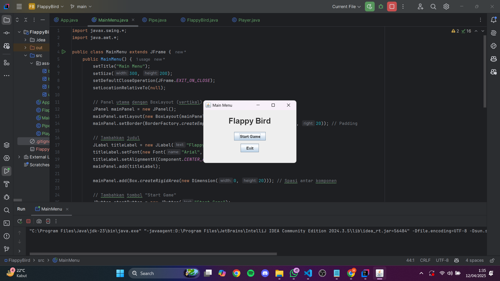
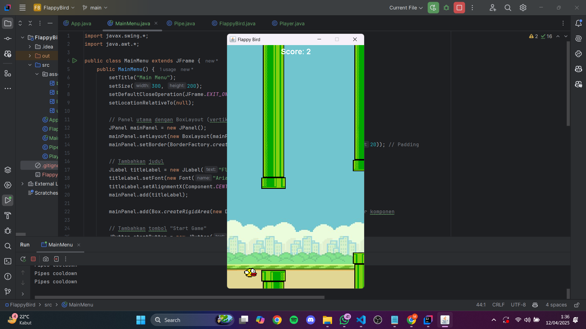
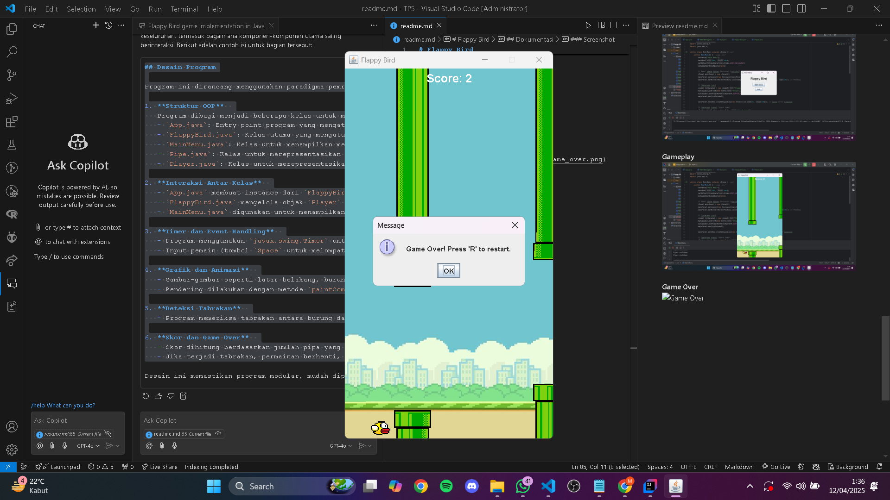

## Janji
Saya Muhammad Isa Abdullah dengan NIM 2303508 mengerjakan Tugas Praktikum 6 dalam mata kuliah Desain dan Pemrograman Berorientasi Objek untuk keberkahanNya maka saya tidak melakukan kecurangan seperti yang telah dispesifikasikan. Aamiin.

# Flappy Bird

Flappy Bird adalah sebuah game sederhana yang dibuat menggunakan Java dan Swing. Pemain mengontrol seekor burung yang harus melewati rintangan berupa pipa tanpa menyentuhnya. Game ini dirancang untuk memberikan pengalaman bermain yang menyenangkan dan menantang.

## Desain Program

Program ini dirancang menggunakan paradigma pemrograman berorientasi objek (OOP) dengan pembagian tugas ke dalam beberapa kelas utama. Berikut adalah penjelasan desain program:

1. **Struktur OOP**  
   Program dibagi menjadi beberapa kelas untuk memisahkan tanggung jawab:
   - `App.java`: Entry point program yang mengatur frame utama.
   - `FlappyBird.java`: Kelas utama yang mengatur logika permainan, termasuk rendering, pergerakan, dan deteksi tabrakan.
   - `MainMenu.java`: Kelas untuk menampilkan menu utama.
   - `Pipe.java`: Kelas untuk merepresentasikan pipa sebagai rintangan.
   - `Player.java`: Kelas untuk merepresentasikan burung yang dikendalikan pemain.

2. **Interaksi Antar Kelas**  
   - `App.java` membuat instance dari `FlappyBird` dan menampilkannya di dalam frame.
   - `FlappyBird.java` mengelola objek `Player` dan `Pipe` untuk mengatur logika permainan.
   - `MainMenu.java` digunakan untuk menampilkan menu utama sebelum permainan dimulai.

3. **Timer dan Event Handling**  
   - Program menggunakan `javax.swing.Timer` untuk mengatur game loop dan spawn pipa secara periodik.
   - Input pemain (tombol `Space` untuk melompat dan `R` untuk restart) ditangani melalui `KeyListener`.

4. **Grafik dan Animasi**  
   - Gambar-gambar seperti latar belakang, burung, dan pipa disimpan di folder `assets/`.
   - Rendering dilakukan dengan metode `paintComponent` di kelas `FlappyBird`.

5. **Deteksi Tabrakan**  
   - Program memeriksa tabrakan antara burung dan pipa atau tanah menggunakan bounding box (hitbox).

6. **Skor dan Game Over**  
   - Skor dihitung berdasarkan jumlah pipa yang berhasil dilewati.
   - Jika terjadi tabrakan, permainan berhenti, dan pesan "Game Over" ditampilkan.

### Penjelasan Kelas
1. **`App.java`**  
   File ini adalah entry point dari program. Kelas ini membuat frame utama dan menambahkan panel game (`FlappyBird`) ke dalamnya.

2. **`FlappyBird.java`**  
   Kelas utama yang mengatur logika permainan, termasuk rendering, pergerakan burung, pipa, deteksi tabrakan, dan penghitungan skor.

3. **`MainMenu.java`**  
   Kelas untuk menampilkan menu utama dengan opsi "Start Game" dan "Exit".

4. **`Pipe.java`**  
   Kelas untuk merepresentasikan pipa sebagai rintangan dalam game. Mengatur posisi, ukuran, dan kecepatan pipa.

5. **`Player.java`**  
   Kelas untuk merepresentasikan burung yang dikendalikan pemain. Mengatur posisi, ukuran, gambar, dan kecepatan burung.

6. **`assets/`**  
   Folder ini berisi gambar-gambar yang digunakan dalam game, seperti:
   - `background.png`
   - `bird.png`
   - `lowerPipe.png`
   - `upperPipe.png`

## Alur Program

1. **Menu Utama**  
   Saat program dijalankan, pemain akan melihat menu utama dengan dua tombol:
   - **Start Game**: Memulai permainan.
   - **Exit**: Keluar dari program.

2. **Gameplay**  
   - Pemain mengontrol burung dengan menekan tombol `Space` untuk melompat.
   - Burung akan jatuh karena gravitasi jika tidak melompat.
   - Pemain harus melewati celah di antara pipa tanpa menyentuhnya.
   - Skor bertambah setiap kali burung berhasil melewati pipa bawah.

3. **Game Over**  
   - Jika burung menyentuh pipa atau tanah, permainan berakhir.
   - Pesan "Game Over" akan muncul, dan pemain dapat menekan tombol `R` untuk memulai ulang permainan.

## Dokumentasi

### Screenshot
**Menu Utama**  

**Gameplay**  

**Game Over**  

